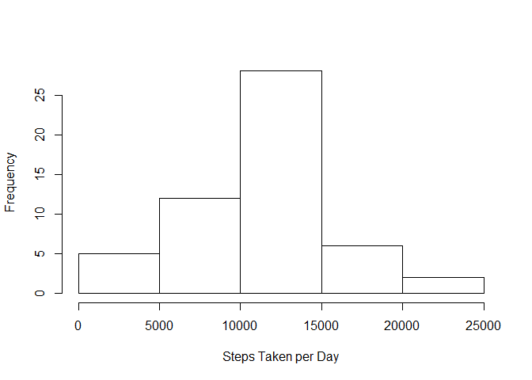
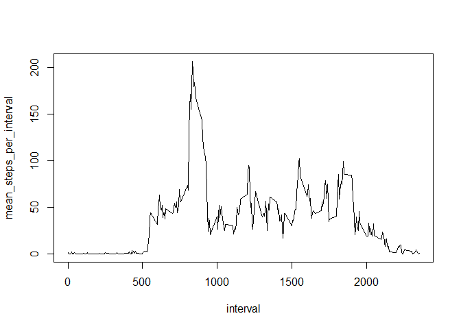
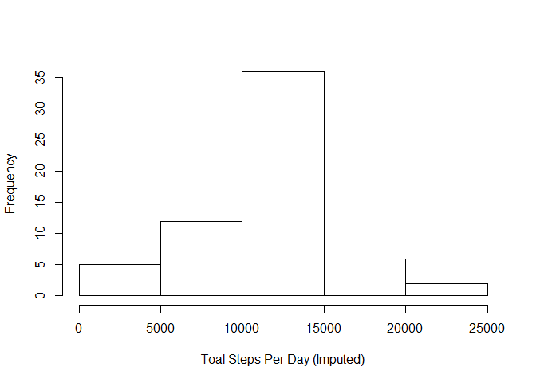
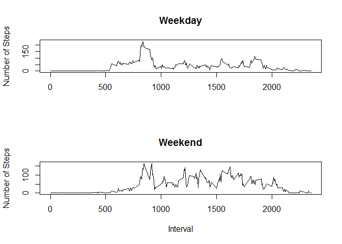
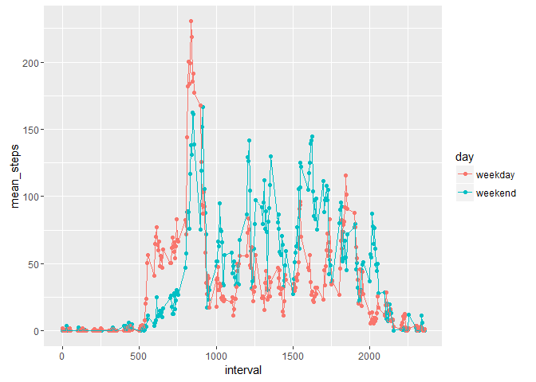

# Reproducible Research: Peer Assessment 1


## Loading and preprocessing the data
##     
First ensure the correct working directory.

```r
rm(list=ls())
setwd("C:/Users/jwang/Dropbox/Coursera Data Science/Reproducible Research/Assignment1/RepData_PeerAssessment1")
```

Check and unzip the activity.zip file and load as dataframe:

```r
if (!file.exists("activity.csv")) {unzip("activity.zip")}
data <- read.csv("activity.csv", stringsAsFactor=F)
library(lubridate)   #load the package, ignore the warnings.
library(dplyr)
library(tidyr)
library(ggplot2)
data$date <- ymd(data$date)  #convert date fromat
```

Get a str() view and summary of the data:

```r
str(data)
```

```
## 'data.frame':	17568 obs. of  3 variables:
##  $ steps   : int  NA NA NA NA NA NA NA NA NA NA ...
##  $ date    : Date, format: "2012-10-01" "2012-10-01" ...
##  $ interval: int  0 5 10 15 20 25 30 35 40 45 ...
```

```r
summary(data)
```

```
##      steps             date               interval     
##  Min.   :  0.00   Min.   :2012-10-01   Min.   :   0.0  
##  1st Qu.:  0.00   1st Qu.:2012-10-16   1st Qu.: 588.8  
##  Median :  0.00   Median :2012-10-31   Median :1177.5  
##  Mean   : 37.38   Mean   :2012-10-31   Mean   :1177.5  
##  3rd Qu.: 12.00   3rd Qu.:2012-11-15   3rd Qu.:1766.2  
##  Max.   :806.00   Max.   :2012-11-30   Max.   :2355.0  
##  NA's   :2304
```


## What is mean total number of steps taken per day?

```r
daily_steps <- data %>%            #calculating steps per day.
    group_by(date) %>%
    mutate(steps_perday = sum(steps)) %>% 
    select(date, steps_perday) %>%
    ungroup() %>%
    distinct(.keep_all=TRUE)
```

Let's look at total steps per day through histogram.

```r
hist(daily_steps$steps_perday, xlab="Steps Taken per Day", main="")
```

<!-- -->

Calculating the mean of Steps taken per day.

```r
mean(daily_steps$steps_perday, na.rm=T)
```

```
## [1] 10766.19
```
Calculating the median of steps taken per day.

```r
median(daily_steps$steps_perday, na.rm=T)
```

```
## [1] 10765
```

## What is the average daily activity pattern?

1. Make a time series plot (i.e. type = "l") of the 5-minute interval (x-axis) and the average number of steps taken, averaged across all days (y-axis)

```r
ds <- data %>%            #calculating means steps per interval.
    group_by(interval) %>%
    mutate(mean_steps_per_interval = mean(steps, na.rm=T)) %>% 
    select(interval, mean_steps_per_interval) %>%
    distinct(.keep_all=TRUE) %>%   #.keep_all=TRUE is required to keep all columns
    ungroup()
    
#qplot(interval, steps, data=ds)
with(ds, plot(interval, mean_steps_per_interval, type="l"))
```

<!-- -->

Which 5-minute interval, on average across all the days in the dataset, contains the maximum number of steps?   
Answer:   

```r
ordered_ds <- ds %>%
    arrange(desc(mean_steps_per_interval))
ordered_ds[1,]
```

```
## Source: local data frame [1 x 2]
## 
##   interval mean_steps_per_interval
##      <int>                   <dbl>
## 1      835                206.1698
```
This can also be obtained this way:

```r
m <- max(ds$mean_steps_per_interval)
ds[ds$mean_steps_per_interval == m,]
```

```
## Source: local data frame [1 x 2]
## 
##   interval mean_steps_per_interval
##      <int>                   <dbl>
## 1      835                206.1698
```


## Imputing missing values
Note that there are a number of days/intervals where there are missing values (coded as NA). The presence of missing days may introduce bias into some calculations or summaries of the data.

1.Calculate and report the total number of missing values in the dataset (i.e. the total number of rows with NAs)


```r
sum(!complete.cases(data$steps))
```

```
## [1] 2304
```


2.Impute the NAs using the average steps on that interval across all days.

```r
data_imputed <- data  #make a copy of the original data.
for (i in 1:nrow(data_imputed)) {
    if (is.na(data_imputed[i, 1])) {
        k <- data_imputed[i,3]         #k as the temporary varaible to store the interval value.
        data_imputed[i,1] <- ds[ds$interval==k, 2]   #replace NA with calculated average steps
    }
    i <- i+1
}
```


Calculating total steps per day. 


```r
ds2 <- data_imputed %>%            #calculating steps per day.
    group_by(date) %>%
    mutate(steps_perday = sum(steps)) %>% 
    select(date, steps_perday) %>%
    ungroup() %>%
    distinct(.keep_all=TRUE)

hist(ds2$steps_perday, xlab="Toal Steps Per Day (Imputed)", main="")
```

<!-- -->

```r
mean(ds2$steps_perday)
```

```
## [1] 10766.19
```

```r
median(ds2$steps_perday)
```

```
## [1] 10766.19
```
The value of mean didn't change, but median has a small difference. This might be due to the choice of imputing method. In this case, the average activity at that specific interval was used to fill in the NAs. This should have the smallest impact on the overall distribution of the data. 


## Are there differences in activity patterns between weekdays and weekends?  

1. Create a new factor variable in the dataset with two levels - "weekday" and "weekend" indicating whether a given date is a weekday or weekend day.

```r
data_imputed  <- mutate(data_imputed, wd = weekdays(date))     #adding a column of weekdays
for (i in 1:nrow(data_imputed)) {
    if (data_imputed[i,4] %in% c("Saturday","Sunday")) {
        data_imputed[i,4] <- "weekend"    
    } else {
        data_imputed[i,4] <- "weekday"
    }
    i <- i+1
}
data_imputed$wd <- as.factor(data_imputed$wd)
str(data_imputed)
```

```
## 'data.frame':	17568 obs. of  4 variables:
##  $ steps   : num  1.717 0.3396 0.1321 0.1509 0.0755 ...
##  $ date    : Date, format: "2012-10-01" "2012-10-01" ...
##  $ interval: int  0 5 10 15 20 25 30 35 40 45 ...
##  $ wd      : Factor w/ 2 levels "weekday","weekend": 1 1 1 1 1 1 1 1 1 1 ...
```

2. Time series plot


```r
avg_weekday <- data_imputed %>%
    filter(wd=="weekday") %>%
    group_by(interval) %>%
    mutate(avg = mean(steps)) %>%
    select(interval, avg) %>%
    distinct(.keep_all=TRUE)
    
avg_weekend <- data_imputed %>%
    filter(wd=="weekend") %>%
    group_by(interval) %>%
    mutate(avg = mean(steps)) %>%
    select(interval, avg) %>%
    distinct(.keep_all=TRUE)
par(mfrow=c(2,1))
with(avg_weekday, plot(interval, avg, type="l",main="Weekday", xlab="", ylab="Number of Steps"))
with(avg_weekend, plot(interval, avg, type="l",main="Weekend", xlab="Interval", ylab="Number of Steps"))
```

<!-- -->

We can also look at this data in the following plot too:

```r
names(avg_weekend) <- c("interval", "weekend")
names(avg_weekday) <- c("interval", "weekday")

avg <- left_join(avg_weekend, avg_weekday, by="interval")
names(avg) <- c("interval", "weekend", "weekday")
avg1 <- gather(avg, day, mean_steps, -interval)
qplot(interval, mean_steps, data=avg1, colour=day, geom=c("point","path"))
```

<!-- -->

It is quite obvious that in weekend, the overall average activity is higher than weekday. Though weekday has higher peak activity than weekend.


